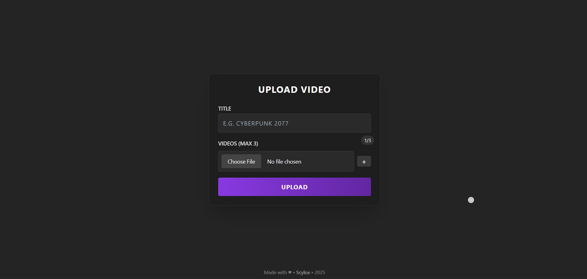

# Hover-Flow 🎥✨

## 🎬 Live Preview

<div align="center">

[](https://youtu.be/1ng6UQTg4Xk)

**▶ [Watch Live Preview on YouTube](https://youtu.be/1ng6UQTg4Xk)**

</div>

  *"Where titles come alive"* 
  
    
  *Fluid hover interactions with instant previews*

  [](https://opensource.org/licenses/MIT)
</div>

## 🎥 Overview

**Hover-Flow** is an immersive media showcase where titles *come alive* on hover — perfect for creators who want to:

- 🎮 Display game clips with cinematic flair  
- 🎬 Showcase video portfolios in seconds  
- ✨ Impress viewers with buttery-smooth animations  

### Why it stands out

- ✅ **Zero-click previews** – Just hover to reveal content  
- ✅ **Dead-simple setup** – No databases or complex config  
- ✅ **Fully customizable** – Tweak styles with ease  

---

## 🌟 Features

- 🎯 **Hover Magic** – Titles reveal video previews with smooth animations  
- 🗂️ **Your Content** – Add any game or media titles  
- 🌀 **Smooth Animations** – 60fps tilt, fade, and scale effects  
- 🎨 **Customizable** – Adjust colors and timing via CSS variables  
- 💎 **Sleek Design** – Dark theme with tasteful accents

## 🛠️ Admin Simplicity

<div align="center">
  
</div>

<p align="center">
  <em>Drag & Drop uploads. Instant previews. Lightweight performance.</em><br>
  - MP4/WebM Support<br>
  - 3-Clip Limit for max smoothness<br>
  - Changes reflect live
</p>


## 💡 Inspired By
Built upon concepts from [@mirayatech](https://github.com/mirayatech/Anime-Scene-Gallery)'s innovative design approach.

<div align="center"> <sub>Turn your media collection into an immersive experience</sub> </div> ```

## 🛠️ Tech Stack

- **Frontend**: HTML5, CSS3, Vanilla JavaScript  
- **Backend**: Node.js, Express  
- **Styling**: Tailwind CSS + Custom Animations

## 🚀 Quick Start

```bash
# Clone and install
git clone https://github.com/Scylox56/Hover-Flow
cd hover-flow && npm install

# Launch
node server.js
```
How To Access:

**Showcase**: http://localhost:3000
**Admin**: http://localhost:3000/admin.html

<div align="center"> <br> <sup>Made with ❤️ and excessive hover effects</sup> </div>

## 📜 License
MIT © [Scylox56](https://github.com/Scylox56)
